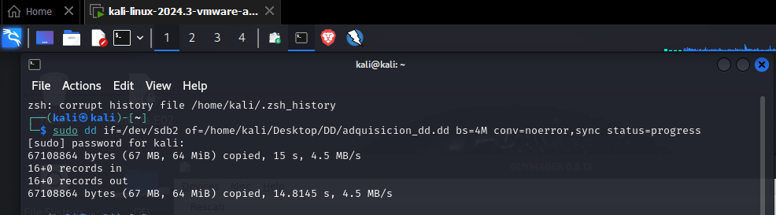
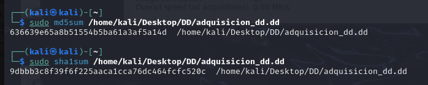

  # Adquisición forense de una memoria USB
  
  La adquisición forense de una memoria USB es un paso crucial en la preservación de evidencias digitales, ya que permite crear una copia exacta de los datos sin alterarlos, asegurando su integridad para su posterior análisis. En este proceso, se utilizan herramientas especializadas que garantizan la obtención de una imagen forense de la memoria USB de forma confiable y verificable. Entre las herramientas más comunes para este fin se encuentran FTK Imager, Guymager y dd.
  
  ## FTK Imager
  
  FTK Imager es una herramienta gráfica ampliamente utilizada en investigaciones forenses digitales, que permite la creación de imágenes forenses de discos y particiones de forma sencilla y con verificación de hash para asegurar la autenticidad de los datos.
  
  
  
  ## Guymager
  
  GuyImager es otra herramienta de adquisición forense que facilita la captura y clonación de dispositivos de almacenamiento, y también incluye opciones de verificación de integridad, siendo popular por su interfaz intuitiva.
  
  
  
  
  ## DD
  
  dd es una utilidad de línea de comandos en sistemas Unix/Linux que permite copiar datos a nivel de bloques, lo que la convierte en una opción poderosa y versátil para la creación de imágenes forenses, aunque requiere precisión en su uso para evitar sobrescribir o modificar datos accidentalmente.
  
  
  

  En esta ilustración podemos ver la intregidad del archivo.

  
  

